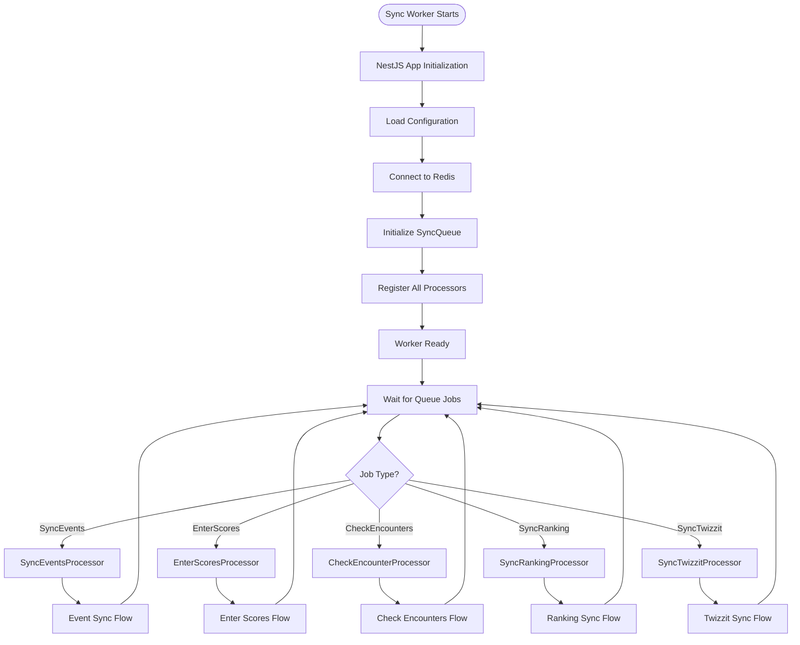
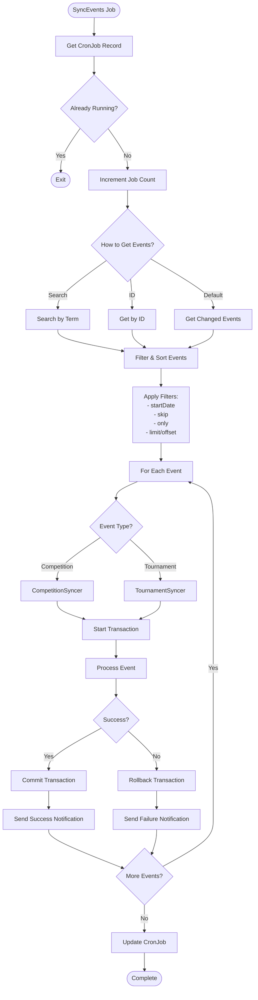
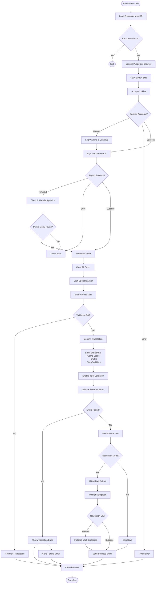
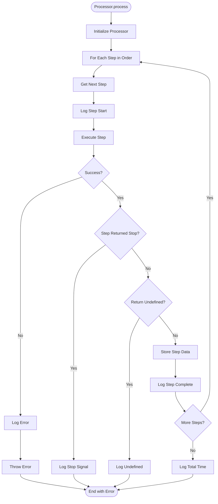

# Sync Worker Flowchart

## Overall Architecture Flow

## SyncEventsProcessor Flow

## CompetitionSyncer Pipeline

```mermaid
graph LR
    Start([Start]) --> Event[1. Event Step<br/>Create/Update EventCompetition]
    Event --> SubEvent[2. SubEvent Step<br/>Create/Update SubEventCompetition]
    SubEvent --> Ranking[3. Ranking Step<br/>Sync Ranking Data]
    Ranking --> Draw[4. Draw Step<br/>Create/Update DrawCompetition]
    Draw --> Entry[5. Entry Step<br/>Create/Update Team Entries]
    Entry --> Encounter[6. Encounter Step<br/>Create/Update EncounterCompetition]
    Encounter --> EncLoc[7. EncounterLocation Step<br/>Update Locations]
    EncLoc --> Player[8. Player Step<br/>Sync Player Data]
    Player --> Game[9. Game Step<br/>Create/Update Games]
    Game --> Point[10. Point Step<br/>Calculate Points]
    Point --> Standing[11. Standing Step<br/>Update Standings]
    Standing --> Cleanup[12. Cleanup Step<br/>Clean Orphaned Data]
    Cleanup --> End([End])

    style Event fill:#e1f5ff
    style SubEvent fill:#e1f5ff
    style Ranking fill:#e1f5ff
    style Draw fill:#e1f5ff
    style Entry fill:#e1f5ff
    style Encounter fill:#e1f5ff
    style EncLoc fill:#e1f5ff
    style Player fill:#e1f5ff
    style Game fill:#e1f5ff
    style Point fill:#e1f5ff
    style Standing fill:#e1f5ff
    style Cleanup fill:#e1f5ff
```

## TournamentSyncer Pipeline

```mermaid
graph LR
    Start([Start]) --> Event[1. Event Step<br/>Create/Update EventTournament]
    Event --> SubEvent[2. SubEvent Step<br/>Create/Update SubEventTournament]
    SubEvent --> Ranking[3. Ranking Step<br/>Sync Ranking Data]
    Ranking --> Draw[4. Draw Step<br/>Create/Update DrawTournament]
    Draw --> Player[5. Player Step<br/>Sync Player Data]
    Player --> Game[6. Game Step<br/>Create/Update Games]
    Game --> Point[7. Point Step<br/>Calculate Points]
    Point --> Standing[8. Standing Step<br/>Update Standings]
    Standing --> End([End])

    style Event fill:#ffe1f5
    style SubEvent fill:#ffe1f5
    style Ranking fill:#ffe1f5
    style Draw fill:#ffe1f5
    style Player fill:#ffe1f5
    style Game fill:#ffe1f5
    style Point fill:#ffe1f5
    style Standing fill:#ffe1f5
```

## EnterScoresProcessor Flow

## CheckEncounterProcessor Flow

```mermaid
graph TB
    Start([CheckEncounters Job]) --> GetCronJob[Get CronJob Record]
    GetCronJob --> CheckRunning{Already Running?}
    CheckRunning -->|Yes| Exit([Exit])
    CheckRunning -->|No| Increment[Increment Job Count]

    Increment --> FindEncounters[Find Unaccepted Encounters<br/>Last 14 Days]
    FindEncounters --> CheckCount{Encounters Found?}

    CheckCount -->|No| UpdateCron[Update CronJob]
    CheckCount -->|Yes| Chunk[Chunk into Groups of 10]

    Chunk --> LoopChunk[For Each Chunk]
    LoopChunk --> LaunchBrowser[Launch Browser]
    LaunchBrowser --> AcceptCookies[Accept Cookies]
    AcceptCookies --> LoopEncounter[For Each Encounter in Chunk]

    LoopEncounter --> LoadEvent[Load Event Data]
    LoadEvent --> CheckEvent{Event Found?}
    CheckEvent -->|No| NextEncounter[Next Encounter]
    CheckEvent -->|Yes| Navigate[Navigate to Encounter Page]

    Navigate --> Consent[Consent Privacy & Cookies]
    Consent --> CheckTime{Has Time?}
    CheckTime -->|No| NextEncounter
    CheckTime -->|Yes| GetStatus[Get Status:<br/>- Entered<br/>- Accepted<br/>- Comments]

    GetStatus --> CheckConfig{Check Encounter Enabled?}
    CheckConfig -->|No| UpdateDB[Update Database]
    CheckConfig -->|Yes| CheckConditions[Check Conditions]

    CheckConditions --> NotEntered24{Not Entered<br/>& 24h Passed<br/>& No Comment?}
    NotEntered24 -->|Yes| NotifyNotEntered[Notify Not Entered]
    NotEntered24 -->|No| CheckAccepted

    CheckAccepted --> NotAccepted48{Not Accepted<br/>& 48h Passed<br/>& No Comment?}
    NotAccepted48 -->|Yes| CheckAutoAccept{Auto Accept Enabled?}
    NotAccepted48 -->|No| CheckComment

    CheckAutoAccept --> CheckTimeEntered{36h Since Entered?}
    CheckTimeEntered -->|Yes| AutoAccept[Auto Accept Encounter]
    CheckTimeEntered -->|No| NotifyNotAccepted[Notify Not Accepted]

    AutoAccept --> AutoAcceptSuccess{Success?}
    AutoAcceptSuccess -->|No| NotifyNotAccepted
    AutoAcceptSuccess -->|Yes| UpdateDB

    CheckComment --> HasComment{Has Comment?}
    HasComment -->|Yes| NotifyComment[Notify Has Comment]
    HasComment -->|No| UpdateDB

    NotifyNotEntered --> UpdateDB
    NotifyNotAccepted --> UpdateDB
    NotifyComment --> UpdateDB

    UpdateDB --> GetDetails[Get Details:<br/>- Start/End Time<br/>- Shuttle<br/>- Game Leader]
    GetDetails --> SaveEncounter[Save Encounter]
    SaveEncounter --> NextEncounter

    NextEncounter --> MoreEncounters{More in Chunk?}
    MoreEncounters -->|Yes| LoopEncounter
    MoreEncounters -->|No| CloseBrowser[Close Browser]

    CloseBrowser --> MoreChunks{More Chunks?}
    MoreChunks -->|Yes| LoopChunk
    MoreChunks -->|No| UpdateCron

    UpdateCron --> Done([Complete])
```

## Processor Step Execution Flow

