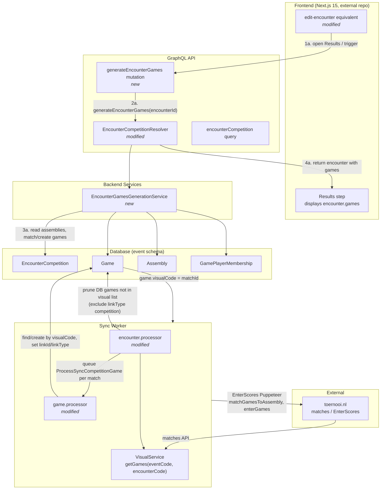

# Architecture: Backend Encounter Games Generation

**Feature:** Generate the 8 encounter games once on the backend from assemblies; frontend consumes `encounter.games` by id; preserve toernooi.nl sync (visualCode).

**References:** [impact_map.md](./impact_map.md), [feature_overview.md](./feature_overview.md), [games-slot-order-and-matchName.md](./games-slot-order-and-matchName.md) (frontend matchName/order semantics).

---

## 1. High-Level Architecture Diagram

**Legend:**  
- **New:** `EncounterGamesGenerationService`, `generateEncounterGames` mutation.  
- **Modified:** encounter resolver (optional auto-trigger), encounter processor (delete guard), game processor (linkId/linkType), Next.js 15 frontend edit-encounter equivalent (external repo; consume `encounter.games`, no client-side generation).

---

## 2. Component Inventory

### New files to create

| File | Type | Responsibility |
|------|------|----------------|
| `libs/backend/competition/encounter/src/services/encounter-games-generation.service.ts` (or under existing competition lib) | Service | Input: encounter id or loaded encounter with games, home/away, assemblies. Resolve 8 canonical slots (double1..4, single1..4; MX order from `ASSEMBLY_POSITION_ORDER`). Per slot: gameType, players from assemblies; match existing games by (gameType + player set) or (gameType + empty + visualCode); create missing games with `linkId` = encounter.id, `linkType` = `"competition"`; set `order` only when game has winner (completion order) or null; set matchName/slotIndex if field exists; set `visualCode` when available. Idempotent: no duplicate games per slot. |
| GraphQL mutation `generateEncounterGames(encounterId: ID)` + resolver method | Resolver | Call `EncounterGamesGenerationService`; return encounter with games (or `{ games: [Game!]! }`). Optionally trigger when loading encounter for edit. |
| Unit tests for `EncounterGamesGenerationService` | Test | Slot order M/F vs MX, player resolution from assemblies, idempotency, create-missing-only vs reassign. |
| Integration tests for `generateEncounterGames` + sync/EnterScores | Test | Mutation for 0 vs 8 existing games; sync does not delete competition games; EnterScores with backend-generated games. |

### Existing files to modify

| File | Change |
|------|--------|
| `libs/backend/graphql/src/resolvers/event/competition/encounter.resolver.ts` | Add `generateEncounterGames(encounterId)` mutation; optionally auto-trigger generation when loading encounter for edit (product decision). |
| `libs/backend/graphql/src/resolvers/game/game.resolver.ts` | Document or restrict `createGame` for competition encounters: create only for missing slot or extra games. |
| `apps/worker/sync/src/app/processors/sync-events-v2/competition/processors/encounter.processor.ts` | When pruning DB games not in visual match list, exclude games where `linkType === "competition"` (or equivalent guard) so backend-generated games without visualCode are not deleted. |
| `apps/worker/sync/src/app/processors/sync-events-v2/competition/processors/game.processor.ts` | For competition encounter jobs (e.g. job has `encounterId`): set `game.linkId = encounter.id`, `game.linkType = "competition"`. Ensure job payload includes `encounterId` where needed. |
| `apps/worker/sync/src/app/processors/enter-scores/pupeteer/enterGames.ts`, `matchGamesToAssembly.ts` | Document that form row is found by assembly position (`findGameRowByAssemblyPosition`) and `game.visualCode` is persisted when missing; backend-generated games without visualCode already work. |
| Next.js 15 frontend (external repo): edit-encounter equivalent | Remove any `createGameObjects` / `getMatchingDatabaseGame` logic; build form from `encounterCompetition.games` (sorted by `order`); bind each card to `game.id`; on save use `updateGame` for existing games by id. |
| Next.js 15 frontend (external repo): Results step / edit-encounter flow | Add trigger for `generateEncounterGames` (explicit button or on Results step open); after success refetch encounter so `encounter.games` is updated. |
| Slot order constant | Add shared constant or backend copy of 8-slot order (M/F and MX) aligned with `apps/worker/sync/src/app/processors/enter-scores/pupeteer/assemblyPositions.ts` (`ASSEMBLY_POSITION_ORDER`). |

---

## 3. Data Flow per Feature

### Scenario 1: User opens Results step → generate games → frontend displays encounter.games

1. **User action:** User opens the Results step of edit-encounter (or clicks “Prepare results” / “Generate games”).
2. **Frontend:** Calls `generateEncounterGames(encounterId)` mutation (or generation is auto-triggered when loading encounter for edit).
3. **HTTP/GraphQL:** `POST` (or equivalent) with mutation `generateEncounterGames(encounterId: ID)`.
4. **Auth:** Standard GraphQL auth; user must have permission to edit the encounter/event.
5. **Resolver:** `EncounterCompetitionResolver.generateEncounterGames(encounterId)` loads encounter with games, home/away, assemblies; calls `EncounterGamesGenerationService.generate(encounter)`.
6. **Service:** For each of 8 canonical slots (from shared slot order): resolve gameType and player IDs from assemblies; match existing encounter game by (gameType + same player set) or (gameType + empty + visualCode); assign slot (matchName/slotIndex if field exists); do not use `order` for slot. For slots with no matched game: `Game.create(...)` with `linkId = encounter.id`, `linkType = "competition"`, gameType, `GamePlayerMembership`; set `order` only when game has winner (completion order) or null; set matchName/slotIndex if field exists; set `visualCode` if available.
7. **DB:** Read `EncounterCompetition`, `Game`, `Assembly`; create/update `Game`, `GamePlayerMembership`; no new tables.
8. **Response:** Return encounter (with games) or `{ games: [Game!]! }`; client refetches or merges.
9. **Frontend:** Displays `encounter.games` sorted by `order`; each card bound to `game.id`; save uses `updateGame` by id.

**Key:** `generateEncounterGames` mutation; `EncounterGamesGenerationService`; `EncounterCompetition`, `Game`, `Assembly`, `GamePlayerMembership`.

---

### Scenario 2: Sync from toernooi.nl → encounter processor → game processor → games with visualCode; backend generation can assign slot/players

1. **Trigger:** Sync worker runs ProcessSyncCompetitionEncounter for an encounter.
2. **Encounter processor** (`encounter.processor.ts`): Fetches matches from toernooi via `VisualService.getGames(eventCode, encounterCode)`. For each match, queues `ProcessSyncCompetitionGame` with `gameCode: match.Code`. Builds set of visual match codes present on toernooi.
3. **Prune step:** Removes DB games whose `visualCode` is not in the visual list **except** games with `linkType === "competition"` (guard so backend-generated games without visualCode are not deleted).
4. **Game processor** (`game.processor.ts`): For each job, finds or creates game by `visualCode` (gameCode). For competition encounter jobs (payload has `encounterId`): sets `game.linkId = encounter.id`, `game.linkType = "competition"` (not draw.id / "tournament"). Updates game fields from sync payload.
5. **DB:** `Game` created/updated with `visualCode`, `linkId`, `linkType`; optionally `GamePlayerMembership` from sync if applicable.
6. **Backend generation:** When `generateEncounterGames` runs later, it can match these games by visualCode (and gameType + empty players), assign slot (order/matchName) and players from assemblies, and create only missing slots.

**Key:** Encounter processor (VisualService, queue game jobs, prune with competition guard); game processor (find/create by visualCode, set linkId/linkType for competition); `Game.visualCode`, `Game.linkId`, `Game.linkType`.

---

### Scenario 3: Sync to toernooi.nl (EnterScores) — form row by assembly position

1. **Trigger:** EnterScores job runs for an encounter (Puppeteer).
2. **Worker:** Loads encounter with games; `matchGamesToAssembly` maps DB games to assembly positions (by player set or visualCode).
3. **enterGames:** For each game (by assembly position), `findGameRowByAssemblyPosition` finds the form row by header/position (does not require `game.visualCode`); fills players and scores; if `game.visualCode` was missing or wrong, sets it to the discovered matchId and persists to DB.
4. **Toernooi.nl:** Form submitted with matchId; scores and winner updated. Games without visualCode can be pushed; visualCode is set and saved during EnterScores.

**Key:** Form row resolved by assembly position; `enterGames.ts`, `matchGamesToAssembly.ts`, `findGameRowByAssemblyPosition`; visualCode persisted when missing.

---

## 4. Shared Utilities / Reusable Patterns

| Item | API / location | Used by |
|------|-----------------|--------|
| Canonical slot order (M/F and MX) | Constant aligned with `ASSEMBLY_POSITION_ORDER` in `apps/worker/sync/src/app/processors/enter-scores/pupeteer/assemblyPositions.ts`; backend copy or shared util in competition lib | `EncounterGamesGenerationService`, sync worker (matchGamesToAssembly), frontend (display order) |
| Encounter load with games + assemblies | Existing `EncounterCompetition.findByPk(id, { include: [Game, Assemblies, ...] })` | Encounter resolver, generation service, sync |
| Game match by (gameType + players) or (gameType + empty + visualCode) | Logic inside `EncounterGamesGenerationService` | Generation only |
| Competition link identity | `linkId = encounter.id`, `linkType = "competition"` | Generation service, game processor, encounter processor (guard) |

---

## 5. Integration Points

| System | Integration | Pattern |
|--------|-------------|---------|
| toernooi.nl (sync FROM) | VisualService.getGames(eventCode, encounterCode) → match codes; encounter processor queues game jobs; game processor creates/updates Game by visualCode | Sync worker processors; linkId/linkType set for competition |
| toernooi.nl (sync TO) | EnterScores Puppeteer finds form row by assembly position (findGameRowByAssemblyPosition); enterGames / matchGamesToAssembly; persists game.visualCode when missing | Games with or without visualCode can be pushed; visualCode set and saved when discovered |
| GraphQL | encounterCompetition(id) returns encounter with games; generateEncounterGames(encounterId) mutation | Query unchanged; new mutation calls generation service |
| Frontend edit-encounter | Consumes `encounter.games`; trigger generateEncounterGames; save via updateGame by id | Remove client-side slot generation; single source of truth from backend |
| Assembly (personal) | Read-only formation (single1..4, double1..4) for resolving players per slot | Generation service reads assemblies; no write |

---

## 6. Key Technical Decisions

| Decision | Choice | Rationale |
|----------|--------|-----------|
| When to generate | Option A: Explicit “Prepare results” / “Generate games” button. Option B: Implicit on Results step open or when both assemblies complete. | Product decision; implementation can support both (mutation + optional auto-trigger in resolver). |
| Idempotency | Create only for slots with no matched game; or “regenerate and reassign”. No duplicate games per slot. | Prevents ghost/duplicate games; policy must be documented and tested. |
| linkId / linkType for competition | `linkId = encounter.id`, `linkType = "competition"` for all encounter-scoped games (generation and sync). | Unifies encounter games and prevents sync from treating them as tournament/draw games; required for prune guard. |
| visualCode lifecycle | visualCode set from toernooi sync when available; backend generation does not invent visualCode. EnterScores finds form row by assembly position (`findGameRowByAssemblyPosition`) and persists visualCode when missing; games without visualCode can be pushed. | Preserves toernooi.nl sync both ways; guard in encounter processor protects backend-created games without visualCode from prune. |
| Slot order source of truth | Single constant (backend or shared) aligned with `ASSEMBLY_POSITION_ORDER` (assemblyPositions.ts); M/F vs MX order documented. | Keeps backend, frontend, and sync worker aligned for slot index and display order. |
| createGame for competition | Restrict or document: create only for missing slot or extra games; frontend uses updateGame for the 8 slots. | Avoids duplicate creates; rare extra-game flow still possible if product allows. |
| Encounter processor prune | Do not delete games where `linkType === "competition"` when pruning DB games not in visual list. | Protects backend-generated games that do not yet have visualCode on toernooi. |

---

This architecture aligns with the [impact map](./impact_map.md) and [feature overview](./feature_overview.md) and is intended for use by the implementation agent and reviewers.
