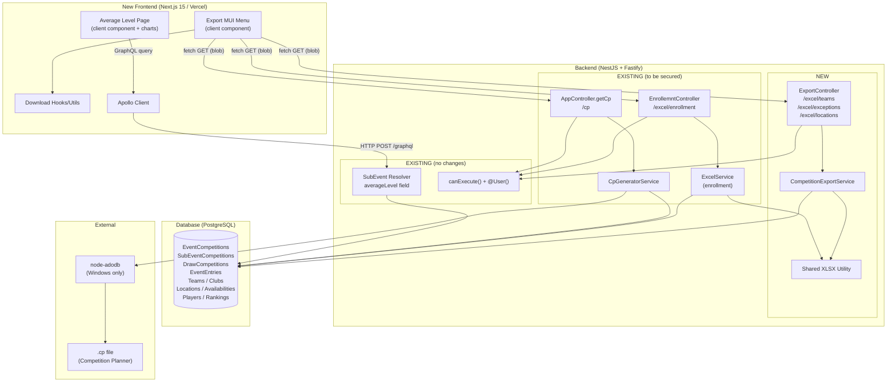

# Architecture Overview: Export/Report Migration

## High-Level Architecture



## Component Inventory

### New Files

| File | Type | Responsibility |
|------|------|----------------|
| `libs/backend/utils/xlsx/src/xlsx.util.ts` | BE Utility | Shared XLSX generation: workbook creation, sheet building with auto-sized columns + autofilter, buffer output |
| `libs/backend/utils/xlsx/src/index.ts` | BE Module | Barrel export for shared XLSX utility |
| `libs/backend/competition/export/src/services/export.service.ts` | BE Service | `CompetitionExportService` with `getTeamsExport()`, `getExceptionsExport()`, `getLocationsExport()` |
| `libs/backend/competition/export/src/controllers/export.controller.ts` | BE Controller | REST endpoints: `GET /excel/teams`, `GET /excel/exceptions`, `GET /excel/locations` |
| `libs/backend/competition/export/src/export.module.ts` | BE Module | NestJS module registering controller + service |
| `libs/backend/competition/export/src/index.ts` | BE Module | Barrel export |
| *FE app*`/competition/[id]/avg-level/page.tsx` | FE Page | Next.js App Router page for average level charts |
| *FE app*`/components/competition/export-menu.tsx` | FE Component | MUI Menu with download buttons, permission-gated |
| *FE app*`/hooks/use-export-download.ts` (or `utils/export-download.ts`) | FE Hook/Util | Fetch + blob download functions for all 5 REST endpoints |

### Existing Files to Modify

| File | Change |
|------|--------|
| `libs/backend/competition/enrollment/src/controllers/excel.controller.ts` | Add auth check (`@User()` + `canExecute`) |
| `libs/backend/competition/enrollment/src/services/excel.services.ts` | Refactor to use shared XLSX utility |
| `apps/api/src/app/controllers/app.controller.ts` | Add auth check on `getCp()` method |
| `apps/api/src/app/app.module.ts` | Import new `CompetitionExportModule` |

## Data Flow per Feature

### Report 1: Average Level (Gemiddeld Niveau)

```
User navigates to /competition/[id]/avg-level
  → Next.js client component renders
  → Apollo Client sends GraphQL query GetAvgLevel
  → Backend GraphQL resolver: SubEventCompetition.averageLevel
    → Sequelize: traverse draws → encounters → games → players → rankings
    → Calculate weighted averages by gender per discipline
    → Return cached result (cache key: subevent-competition-average-level-{id})
  → Frontend renders charts (recharts/nivo/apexcharts)
  → User clicks "Download CSV" → client-side CSV generation → blob download
```

**Auth:** `edit:competition` permission checked on frontend (route guard).
**Response:** GraphQL JSON → rendered as charts.

### Report 2: Download Base Players (Basis Spelers)

```
User clicks "Download basis spelers" in export menu
  → fetch GET /api/v1/excel/enrollment?eventId={id}
  → EnrollemntController.getBaseplayersEnrollment()
    → canExecute(user, { anyPermissions: ['edit:competition'] })
    → ExcelService.GetEnrollment(eventId)
      → EventCompetition.findByPk(eventId)
      → Traverse subEvents → draws → entries → players
      → Build XLSX via shared utility (headers: Naam, Voornaam, Lidnummer, Geslacht, etc.)
    → Return buffer with Content-Disposition header
  → Frontend receives blob → triggers download as {event.name}.xlsx
```

**Auth:** `edit:competition` (currently missing — to be added).
**Response:** XLSX blob, `application/vnd.openxmlformats-officedocument.spreadsheetml.sheet`.

### Report 3: Download Teams (Ploegen)

```
User clicks "Download ploegen" in export menu
  → fetch GET /api/v1/excel/teams?eventId={id}
  → ExportController.getTeamsExport()
    → canExecute(user, { anyPermissions: ['export-teams:competition'] })
    → CompetitionExportService.getTeamsExport(eventId)
      → EventCompetition.findByPk(eventId) (validate exists)
      → Traverse subEvents → draws → entries (include Team → Club)
      → Deduplicate by team.id
      → Build XLSX via shared utility
        Headers: Club ID, Clubnaam, Ploegnaam, Voorkeur speelmoment (dag), Voorkeur speelmoment (tijdstip)
    → Return buffer with Content-Disposition header
  → Frontend receives blob → triggers download as {event.name}-teams.xlsx
```

**Auth:** `export-teams:competition`.
**Response:** XLSX blob.

### Report 4: Download Exceptions (Uitzonderingen)

```
User clicks "Download uitzonderingen" in export menu
  → fetch GET /api/v1/excel/exceptions?eventId={id}
  → ExportController.getExceptionsExport()
    → canExecute(user, { anyPermissions: ['export-exceptions:competition'] })
    → CompetitionExportService.getExceptionsExport(eventId)
      → EventCompetition.findByPk(eventId) (validate exists)
      → Traverse subEvents → draws → entries → Club → Location → Availability → exceptions
      → For each exception: generate date range (start → end, one row per day)
      → Format dates: Belgian locale (DD/MM/YYYY, Europe/Brussels)
      → Deduplicate by composite key: (clubId, locationName, date)
      → Build XLSX via shared utility
        Headers: Club ID, Clubnaam, Locatie, Datum, Velden
    → Return buffer with Content-Disposition header
  → Frontend receives blob → triggers download as {event.name}-exceptions.xlsx
```

**Auth:** `export-exceptions:competition`.
**Response:** XLSX blob.

### Report 5: Download Locations (Locaties)

```
User clicks "Download locaties" in export menu
  → fetch GET /api/v1/excel/locations?eventId={id}
  → ExportController.getLocationsExport()
    → canExecute(user, { anyPermissions: ['export-locations:competition'] })
    → CompetitionExportService.getLocationsExport(eventId)
      → EventCompetition.findByPk(eventId) (validate exists)
      → Traverse subEvents → draws → entries → Club → Location → Availability → days
      → Build address: [street, streetNumber, postalcode, city].filter(Boolean).join(' ')
      → Translate day names EN → NL (monday → Maandag, etc.)
      → Deduplicate by composite key: (clubId, locationName, day)
      → Build XLSX via shared utility
        Headers: Club ID, Clubnaam, Locatie, Adres, Dag, Aantal Velden
    → Return buffer with Content-Disposition header
  → Frontend receives blob → triggers download as {event.name}-locations.xlsx
```

**Auth:** `export-locations:competition`.
**Response:** XLSX blob.

### Report 6: Download CP File

```
User clicks "Download cp file" in export menu
  → fetch GET /api/v1/cp?eventId={id}
  → AppController.getCp()
    → canExecute(user, { anyPermissions: ['change:job'] })
    → CpGeneratorService.generateCpFile(eventId)
      → Fetch event, prepare ADODB connection to template
      → Sequentially add: events, clubs, locations, teams, entries, players, memos
      → Write to .cp file (Microsoft Access format via node-adodb)
    → Stream file with Content-Disposition header
  → Frontend receives blob → triggers download as {event.name}.cp
```

**Auth:** `change:job` (currently missing — to be added).
**Response:** `.cp` binary blob. Only works on Windows servers (node-adodb dependency). Target: Competition Planner desktop software.

## Shared Utilities / Reusable Patterns

### Shared XLSX Utility (`libs/backend/utils/xlsx/`)

Extracts the recurring XLSX generation pattern used across enrollment, teams, exceptions, and locations exports:

```typescript
// Core API surface:
createWorkbook(): XLSX.WorkBook
addSheet(workbook: XLSX.WorkBook, name: string, headers: string[], rows: any[][]): void
  // Internally: aoa_to_sheet, auto-sized columns, autofilter on header row
toBuffer(workbook: XLSX.WorkBook): Buffer
```

**Used by:**
- `ExcelService.GetEnrollment()` (refactored)
- `CompetitionExportService.getTeamsExport()`
- `CompetitionExportService.getExceptionsExport()`
- `CompetitionExportService.getLocationsExport()`
- Future export services

### Blob Download Pattern (Frontend)

Reusable download utility for the Next.js frontend:

```typescript
async function downloadBlob(url: string, filename: string): Promise<void>
  // fetch(url) → response.blob() → URL.createObjectURL → anchor click → cleanup
```

## Integration Points

| System | Integration | Pattern |
|--------|-------------|---------|
| **Authentication** | All REST export endpoints | `@User() user: Player` decorator extracts authenticated user from request |
| **Authorization** | Permission checks per endpoint | `canExecute(user, { anyPermissions: [...] })` utility from `libs/backend/graphql/src/utils/can-exexcute.ts` |
| **GraphQL** | Average level data | Existing `SubEventCompetition.averageLevel` resolver field — no changes needed |
| **Sequelize ORM** | All data access | Direct model imports (`EventCompetition.findByPk()`, eager loading with `include`) — follows existing codebase pattern |
| **Fastify** | Response streaming | `FastifyReply` for setting Content-Type, Content-Disposition headers and sending buffers |
| **NestJS modules** | New module registration | `CompetitionExportModule` imported in `apps/api/src/app/app.module.ts` |

## Key Technical Decisions

| Decision | Choice | Rationale |
|----------|--------|-----------|
| REST vs. GraphQL for exports | **REST** | File downloads are a poor fit for GraphQL. Existing export endpoints (enrollment, CP) already use REST. Consistent with established pattern. |
| Server-side vs. client-side XLSX generation | **Server-side** | Legacy app generated XLSX in the browser. Moving to server-side is better for: (1) keeping business logic in one place, (2) not shipping the xlsx library to the client, (3) consistency with the enrollment export which is already server-side. |
| Shared XLSX utility | **Extract into reusable module** | The same autosize + autofilter pattern is used in 4+ places. A shared utility reduces duplication and makes future exports faster to build. |
| Charting library (FE) | **TBD (recharts / nivo / react-apexcharts)** | Legacy used ApexCharts (Angular wrapper). For Next.js/React, evaluate recharts (lightweight, good MUI integration), nivo (rich but heavier), or react-apexcharts (closest to legacy). Decision should be made at implementation time based on dual Y-axis support and dark theme compatibility. |
| Permission model | **Per-user assignment** | Permissions already exist in the database and are assigned to individual users (not roles). No seeding or role mapping needed. |
| CP file platform | **Windows-only (accepted)** | The .cp file targets Competition Planner desktop software which itself only runs on Windows. The node-adodb Windows dependency is an accepted constraint. |
