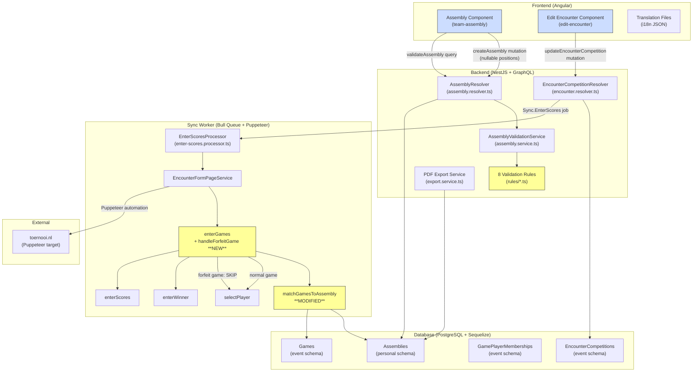

# Architecture Overview: Incomplete Team Formation & Forfeit Sync

## 1. High-Level Architecture Diagram



**Legend:**
- Yellow fill = Modified components (core changes)
- Blue fill = Modified components (UI changes)
- No fill = Unchanged components

---

## 2. Component Inventory

### New files to create

| File | Type | Responsibility |
|------|------|----------------|
| `apps/worker/sync/.../pupeteer/__tests__/matchGamesToAssembly.spec.ts` | Test | Unit tests for forfeit-aware game-to-assembly matching |
| `docs/estimates/incomplete-team-forfeit/toernooi-test-results.md` | Doc | Manual test results from toernooi.nl verification |

### Existing files to modify

| File | Change |
|------|--------|
| `apps/worker/sync/.../pupeteer/matchGamesToAssembly.ts` | Add forfeit position handling with `isForfeit` marker; skip player-ID matching for null positions |
| `apps/worker/sync/.../pupeteer/enterGames.ts` | Add `handleForfeitGame()` helper; skip `selectPlayer()` for forfeit positions; enter forfeit winner status |
| `apps/worker/sync/.../enter-scores.errors.ts` | Add `FORFEIT_SYNC_FAILED` error code |
| `apps/worker/sync/.../guards.ts` | Add `ENTER_SCORES_FORFEIT_ENABLED` feature flag check |
| `libs/backend/competition/assembly/src/services/validate/rules/player-order.rule.ts` | Add null guards for empty positions |
| `libs/backend/competition/assembly/src/services/validate/rules/player-max-games.rule.ts` | Add null guards |
| `libs/backend/competition/assembly/src/services/validate/rules/player-min-level.rule.ts` | Add null guards |
| `libs/backend/competition/assembly/src/services/validate/rules/player-gender.rule.ts` | Add null guards |
| `libs/backend/competition/assembly/src/services/validate/rules/player-comp-status.rule.ts` | Add null guards |
| `libs/backend/competition/assembly/src/services/validate/rules/team-base-index.rule.ts` | Add null guards |
| `libs/backend/competition/assembly/src/services/validate/rules/team-subevent-index.rule.ts` | Add null guards |
| `libs/backend/competition/assembly/src/services/validate/rules/team-club-base.rule.ts` | Add null guards |
| `libs/backend/competition/assembly/src/services/validate/assembly.service.ts` | Add "team incomplete" warning when positions are null |
| `libs/backend/competition/assembly/src/services/validate/assembly.service.spec.ts` | Add tests for incomplete assemblies |
| `libs/backend/competition/assembly/src/services/export/export.service.ts` | Render empty slots as "Forfait" in PDF |
| `libs/frontend/pages/competition/team-assembly/.../assembly/assembly.component.ts` | Add forfeit badge on empty slots |
| `libs/frontend/pages/competition/team-assembly/.../assembly/assembly.component.html` | Forfeit visual indicator |
| `libs/frontend/pages/competition/event/.../edit-encounter/edit-encounter.page.ts` | Add forfeit toggle per game, auto-fill scores |
| `libs/frontend/pages/competition/event/.../edit-encounter/edit-encounter.page.html` | Forfeit UI elements |
| Translation JSON files (i18n) | New keys: forfeit, team-incomplete, no-player |
| `apps/badman-e2e/src/tests/assembly.e2e.spec.ts` | E2E test for 3-player assembly |

---

## 3. Data Flow per Feature

### Flow 1: Saving an incomplete assembly (3 players)

1. **User action:** Drags 3 players into assembly slots, leaves single4 empty
2. **Frontend:** `AssemblyComponent` emits `updatedAssembly$` -> form controls set `single4 = null`
3. **GraphQL:** `createAssembly` mutation fires with `single4: null`
4. **Auth check:** `@User() user: Player` decorator verifies JWT
5. **Resolver:** `AssemblyResolver.createAssembly()` calls `Assembly.findOrCreate()`
6. **DB:** `personal.Assemblies` row created/updated with `assembly.single4 = undefined` in JSON
7. **Validation (parallel):** `validateAssembly` query fires -> `AssemblyValidationService.validate()`
8. **Rules:** Each of 8 rules runs, skipping null positions -> returns `warnings: ["Position single4 is empty"]`
9. **Response:** Frontend shows validation warnings; save succeeds

### Flow 2: Entering scores with a forfeit game

1. **User action:** On edit-encounter form, toggles "forfeit" on game 7 (HE3)
2. **Frontend:** `EditEncounterComponent` sets game 7 player controls to `null`, scores to `21-0 21-0`, winner to `AWAY_TEAM_FORFEIT (5)`
3. **GraphQL:** `updateEncounterCompetition` mutation fires with `finished: true`
4. **Auth check:** `change-any:encounter` or encounter-specific permission
5. **Resolver:** `EncounterCompetitionResolver.updateEncounterCompetition()` checks `shouldUpdateToernooiNL`
6. **Queue:** Adds `Sync.EnterScores` job to Bull queue
7. **Response:** Encounter updated in DB

### Flow 3: Puppeteer sync of encounter with forfeit game

1. **Worker:** `EnterScoresProcessor.enterScores()` picks up job
2. **Load:** `loadEncounter()` fetches encounter with games, assemblies, players
3. **Login:** Puppeteer signs into toernooi.nl
4. **Edit mode:** Navigates to encounter edit form
5. **Match games:** `matchGamesToAssembly()` runs:
   - For positions with players: matches by player IDs (existing logic)
   - For forfeit positions (null in assembly): marks as `isForfeit: true`
6. **Enter games:** `enterGames()` iterates assembly positions:
   - **Normal game:** `findGameRowByAssemblyPosition()` -> `selectPlayer()` x4 -> `enterScores()` -> `enterWinner()`
   - **Forfeit game:** `findGameRowByAssemblyPosition()` -> **skip selectPlayer()** -> `enterWinner(forfeitStatus)` -> **skip enterScores()**
7. **Validate:** `validateRowMessages()` checks for errors
8. **Save:** `waitForSaveResult()` clicks save, waits for navigation
9. **Stamp:** `encounter.update({ scoresSyncedAt: new Date() })`
10. **Notify:** Success email sent

---

## 4. Shared Utilities / Reusable Patterns

### `WINNER_STATUS` constants (existing)

**File:** `libs/backend/database/src/models/event/game.model.ts`

```typescript
export const WINNER_STATUS = {
  HOME_TEAM_FORFEIT: 4,
  AWAY_TEAM_FORFEIT: 5,
  HOME_TEAM_PLAYER_ABSENT: 6,
  AWAY_TEAM_PLAYER_ABSENT: 7,
  // ... other statuses
};
```

**Used by:** `enterGames.ts` (new forfeit handling), `Game.updateEncounterScore()` (existing score calculation)

### `getAssemblyPositionsInOrder()` (existing)

**File:** `apps/worker/sync/.../pupeteer/assemblyPositions.ts`

```typescript
export const getAssemblyPositionsInOrder = (teamType: SubEventTypeEnum): string[]
```

**Used by:** `enterGames.ts`, `matchGamesToAssembly.ts`

### `handleForfeitGame()` (new)

**File:** `apps/worker/sync/.../pupeteer/enterGames.ts`

```typescript
async function handleForfeitGame(
  page: Page,
  teamType: SubEventTypeEnum,
  assemblyPosition: string,
  forfeitSide: 'home' | 'away' | 'both',
  logger?: Logger
): Promise<void>
```

**Used by:** `enterGames()` main loop

---

## 5. Integration Points

| System | Integration | Pattern |
|--------|-------------|---------|
| toernooi.nl | Score entry form automation | Puppeteer page navigation + form fill. **Modified:** empty `<select>` dropdowns left at default for forfeit positions |
| Bull Queue | Job scheduling for sync | Existing `Sync.EnterScores` job. No change to job structure |
| Sentry | Error tracking | Existing tags + new `FORFEIT_SYNC_FAILED` error code |
| Email (MailingService) | Success/failure notifications | Existing `sendEnterScoresSuccessMail` / `sendEnterScoresFailedMail`. No change needed |
| GraphQL API | Assembly CRUD + validation | Existing mutations/queries. No schema changes |
| PDF Service | Assembly PDF export | Existing export endpoint. Modified to show "Forfait" for empty slots |

---

## 6. Key Technical Decisions

| Decision | Choice | Rationale |
|----------|--------|-----------|
| No database migration | Use existing nullable fields | The `AssemblyData` interface and `Game.winner` statuses already support the required data. Adding columns would be unnecessary complexity. |
| Position-order fallback in matchGamesToAssembly | Match forfeit positions by assembly position name, not player IDs | When a position has no players, there are no IDs to match against. Using the assembly position order (defined in `ASSEMBLY_POSITION_ORDER`) provides a deterministic mapping to form rows. |
| Skip selectPlayer for forfeits | Leave `<select>` at default value | [ASSUMPTION] toernooi.nl interprets an unselected player dropdown as "no player", which is the correct forfeit behavior. Selecting a player would cause the duplicate-player conflict described in the bug report. |
| Feature flag for forfeit sync | `ENTER_SCORES_FORFEIT_ENABLED` env var | The Puppeteer sync is high-risk (external dependency). A feature flag allows deploying frontend changes first and enabling sync separately after manual testing. |
| Forfeit winner status mapping | `HOME_TEAM_PLAYER_ABSENT (6)` for missing home player, `AWAY_TEAM_PLAYER_ABSENT (7)` for missing away player | These statuses are the closest semantic match in the existing `WINNER_STATUS` enum. `HOME_TEAM_FORFEIT (4)` / `AWAY_TEAM_FORFEIT (5)` are for when the entire team forfeits, not individual game positions. [ASSUMPTION] This mapping matches what toernooi.nl expects. |
| Warning, not error, for incomplete assembly | Return `valid: false` with warnings | Allows the existing "continue despite warnings?" dialog to handle incomplete teams without new UI flow. The `isComplete` boolean on Assembly can optionally be set to `false`. |
