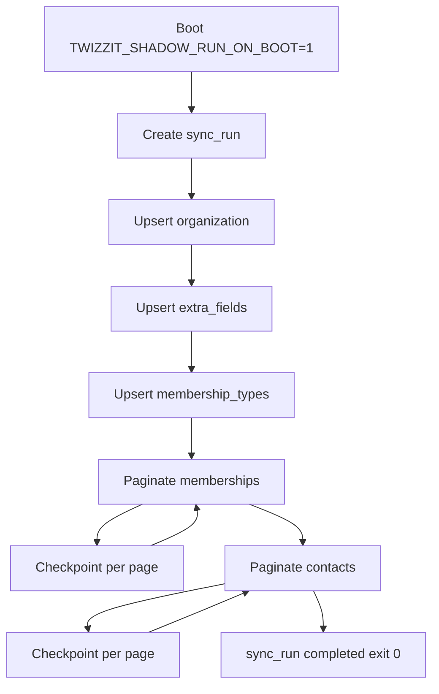

# Implementation Plan: Twizzit Shadow Sync

**Branch**: `017-speckit-git-feature` | **Date**: 2026-05-15 | **Spec**: [spec.md](spec.md)
**Input**: Feature specification from `/specs/016-twizzit-shadow-sync/spec.md`

## Summary

Backfill Twizzit federation data into a dedicated PostgreSQL **`twizzit`** schema (shadow tables) using a **new Render background worker** (`apps/worker/twizzit-shadow`) that calls **`@badman/integrations-twizzit-client`** only. The pipeline runs **one or a few full paginated pulls** with per-page checkpoints, inter-page pacing, and client-level 429 backoff — then stops. **No comparison** to Badman `Player` / memberships in this feature; no writes to operational tables. Legacy `sync-twizzit` / `@badman/backend-twizzit` XML path is untouched.

## Technical Context

**Language/Version**: TypeScript 5.x, Node.js 20+ (align with `apps/worker/sync`).
**Primary Dependencies**: NestJS (Fastify), Sequelize (`sequelize-typescript`), `@badman/integrations-twizzit-client`, `@badman/backend-database`, Winston (via existing worker logging).
**Storage**: PostgreSQL schema `twizzit` — JSONB `payload` + indexed identity columns per [data-model.md](data-model.md).
**Testing**: Jest — unit tests with mocked `FederationGateway` + Sequelize; opt-in `*.integration.spec.ts` against docker postgres (`RUN_INTEGRATION_TESTS=1`).
**Target Platform**: Render background worker (separate service from API + `worker-sync`); local via `nx run worker-twizzit-shadow:serve`.
**Project Type**: Nx monorepo — new worker app + new backend lib + migrations + database models.
**Performance Goals**: Complete full federation backfill without manual intervention in ≥95% of runs (SC-002); resume within 15 minutes after crash (SC-003). Expect hours for ~160k contacts at 100/page + 250ms delay — acceptable for one-off backfill.
**Constraints**:
- No Bull / `sync` queue coupling in v1.
- No GraphQL exposure of shadow tables in v1.
- No `@badman/backend-twizzit` (legacy) imports.
- Comparison / reconciliation deferred to follow-up spec.
**Scale/Scope**: 5 entity types; ~160k+ contacts; 6 Sequelize shadow models + 2 run metadata models; 1 migration creating schema + tables.

## Constitution Check

*GATE: Must pass before Phase 0 research. Re-check after Phase 1 design.*

| Principle | Applies? | Verdict | Notes |
|-----------|----------|---------|-------|
| I. Code-First GraphQL via Sequelize Models | **Partial** | **PASS with exception** | Shadow tables are Sequelize-only (no `@ObjectType`). They are ETL staging, not Badman domain entities. See Complexity Tracking. |
| II. Translation Discipline | **No** | **PASS** | No i18n changes. |
| III. Transactional Mutations | **No** | **PASS** | No GraphQL mutations. Ingest uses per-page Sequelize transactions (commit/rollback). |
| IV. Resolver Test Discipline | **No** | **PASS** | Ingest service tests: mocked gateway + DB; integration tests per repo convention. |
| V. Legacy Frontend Boundary | **No** | **PASS** | No frontend changes. |

**Technology stack alignment**: ✅ Nx, NestJS workers, Sequelize migrations, Jest, `@badman/integrations-twizzit-client`.

**Re-check after Phase 1**: Still PASS — design does not introduce GraphQL or i18n surface.

## Project Structure

### Documentation (this feature)

```text
specs/016-twizzit-shadow-sync/
├── plan.md              # This file
├── research.md          # Phase 0 — R1–R10 decisions
├── data-model.md        # Phase 1 — twizzit schema tables
├── quickstart.md        # Phase 1 — local + Render ops
├── contracts/
│   ├── shadow-ingest-service.md
│   └── worker-bootstrap.md
├── checklists/
│   └── requirements.md
└── spec.md
```

### Source Code (repository root)

```text
database/migrations/
└── YYYYMMDDHHMMSS-create-twizzit-shadow-schema.js

libs/backend/database/src/models/twizzit/
├── sync-run.model.ts
├── sync-checkpoint.model.ts
├── shadow-organization.model.ts
├── shadow-extra-field.model.ts
├── shadow-membership-type.model.ts
├── shadow-membership.model.ts
├── shadow-contact.model.ts
└── index.ts

libs/backend/twizzit-shadow/
├── project.json
├── jest.config.ts
├── src/
│   ├── index.ts
│   ├── twizzit-shadow.module.ts
│   ├── twizzit-shadow-ingest.service.ts   # pipeline + checkpoints
│   ├── twizzit-shadow-ingest.service.spec.ts
│   ├── pagination/page-runner.ts          # generic offset loop + delay
│   └── tokens.ts                          # FEDERATION_GATEWAY
└── test/
    └── twizzit-shadow-ingest.integration.spec.ts  # opt-in

apps/worker/twizzit-shadow/
├── project.json
├── webpack.config.js
├── src/
│   ├── main.ts
│   ├── instrument.ts                      # if Sentry parity with other workers
│   └── app/
│       ├── app.module.ts
│       └── twizzit-shadow-runner.service.ts  # onApplicationBootstrap one-shot
└── ...

libs/integrations/twizzit-client/   # unchanged consumer; already implements FederationGateway
```

**Structure Decision**: Three deliverables — migration + models (`backend-database`), ingest lib (`backend-twizzit-shadow`), deployable worker (`worker-twizzit-shadow`). Keeps shadow logic testable without booting Nest worker. Client lib stays read-only.

## Phase 0: Research

Complete — see [research.md](research.md). All Technical Context unknowns resolved:

- Separate Render worker (not `worker-sync`)
- One-shot / manual trigger (not cron)
- `twizzit` schema + JSONB + indexed columns
- Ingest order + page checkpoints
- `TwizzitClient` for all HTTP

## Phase 1: Design

### Data model

[data-model.md](data-model.md) — tables `sync_run`, `sync_checkpoint`, `shadow_*` for five entity types. Contact natural key columns for later duplicate analysis.

### Contracts

- [contracts/shadow-ingest-service.md](contracts/shadow-ingest-service.md) — `runFullBackfill`, upsert, error policy
- [contracts/worker-bootstrap.md](contracts/worker-bootstrap.md) — Nest wiring, env vars, Render ops

### Ingest pipeline (implementation sketch)



Pagination: for each page, `gateway.fetch*({ pageSize, maxPages: 1, offset })` **or** internal helper that slices offset manually if client only exposes full auto-pagination — **implementation note**: prefer extending page runner to call low-level paginated endpoint helpers if `maxPages: 1` truncation is insufficient for checkpointing; verify against `libs/integrations/twizzit-client/src/pagination.ts` during tasks (may need `fetchContactsPage(offset)` wrapper in ingest lib).

### Agent context

`AGENTS.md` SPECKIT block updated to reference this plan.

## Phase 2: Tasks (not created here)

`/speckit-tasks` should generate ordered work:

1. Migration + models
2. `backend-twizzit-shadow` lib + unit tests
3. `worker-twizzit-shadow` app + Render/docs
4. Integration test + staging dry run checklist
5. Register `system.Service` row (manual ops task)

## Complexity Tracking

| Violation | Why Needed | Simpler Alternative Rejected Because |
|-----------|------------|-------------------------------------|
| Principle I — Sequelize models without `@ObjectType` | Shadow rows are internal ETL staging, never served via GraphQL; exposing 160k contacts would violate API boundaries | Full code-first GraphQL models would imply resolvers and leak staging data to clients |
| New worker app (4th worker) | Spec requires isolated Render service and lifecycle distinct from Bull-driven `worker-sync` | Reusing `worker-sync` conflates orchestration and prolongs unrelated service uptime during multi-hour backfill |

## Risk register

| Risk | Mitigation |
|------|------------|
| Rate limits on full contact pull | Inter-page delay env; client 429 retry; coordinate with Twizzit (Q3); run off-peak |
| Pagination API vs checkpoint | Verify page-level fetch in tasks; add thin offset API on ingest lib if needed |
| Disk / JSONB size | Monitor table size post-staging; payload is required for faithful later diff |
| Legacy sync-twizzit confusion | Document in quickstart; no imports from `backend-twizzit` |
